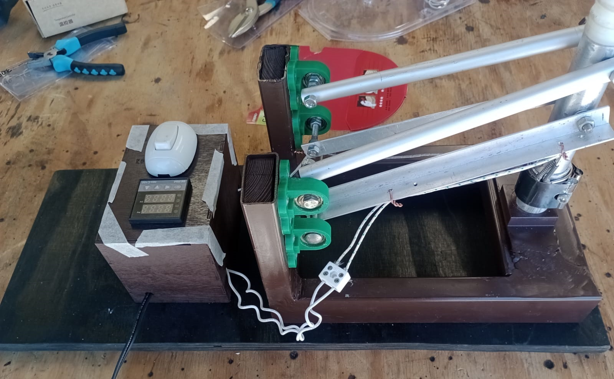

# Optimización del Control de Temperatura en Máquina de Sellado

## Descripción del Proyecto

El objetivo de este proyecto es mejorar el control de temperatura en una máquina de sellado por herramienta caliente. La precisión en el control térmico es esencial para asegurar la calidad y consistencia del sellado, evitando productos defectuosos y costos adicionales de producción.

## Problema

Actualmente, la máquina de sellado presenta desafíos en el control de temperatura debido a la ubicación inadecuada de la termocupla K. Esto resulta en mediciones imprecisas que comprometen la calidad del sellado, generando sobrecalentamiento, subcalentamiento y desperdicio de material.

## Soluciones Propuestas

### 1. Reubicación de la Termocupla K

Se propone mover la termocupla a una ubicación en la superficie de contacto que refleje con mayor precisión la temperatura del material durante el sellado. Esta estrategia busca mejorar significativamente la precisión de la medición de temperatura.

### 2. Evaluación del Controlador Autoajustado

Se plantea desarrollar un sistema para evaluar los parámetros del controlador PID autoajustado. Utilizaremos hardware basado en Arduino para capturar datos de sensores de temperatura y voltaje del relé. El software en Python analizará el rendimiento del controlador.

## Arquitectura del Software

El proyecto se estructurará en varios módulos, cada uno con funciones específicas:

### Módulo de Adquisición de Datos

- Lee los datos de los sensores de temperatura, voltaje del relé y otros sensores relevantes.
- Implementa un filtro digital para eliminar el ruido de las señales mediante muestreo.
- Almacena los datos en un pequeño caché transmitido constantemente por el puerto serial.

### Módulo de Procesamiento de Datos

- Calcula la respuesta del sistema a la acción de control (método de pasos) para la termocupla, resistencia y superficie.
- Permite al usuario ingresar los parámetros del PID y la temperatura de referencia.
- Visualiza gráficos de datos para análisis y toma de decisiones.

### Módulo de Evaluación del Controlador

- Evalúa el rendimiento del controlador, extrayendo métricas como tiempo de respuesta, sobreimpulso y error de estado estable.
- Cataloga el rendimiento del controlador autoajustado con valores de parámetros PID y heurísticas.

### Interfaz Gráfica de Usuario

- Muestra datos de sensores en tiempo real.
- Permite al usuario ingresar parámetros del controlador PID y temperatura de referencia.
- Visualiza gráficos de respuesta del sistema y resultados de evaluación del controlador.

### Pipeline

- Arduino adquiere y transmite datos de sensores al sistema de procesamiento.
- Python procesa y analiza datos, presentando resultados al usuario.
- Usuario interactúa con la interfaz para ajustar parámetros del controlador según sea necesario.

### Tabla de Especificaciones y Estado

| Módulo | Especificación | Estado |
| ------ | -------------- | ------ |
| Módulo de Adquisición de Datos | Lee datos de sensores | ✅/❌ (requiere revisar en lab, se hizo un mock) |
|                                  | Implementa filtro digital | ✅ |
|                                  | Almacena datos en caché | ✅ |
| Módulo de Procesamiento de Datos | Calcula respuesta del sistema | ❌ |
|                                     | Permite ingreso de parámetros PID | ❌ |
|                                     | Visualiza gráficos de datos | ❌ |
| Módulo de Evaluación del Controlador | Evalúa rendimiento del controlador | ❌ |
|                                            | Cataloga rendimiento del controlador autoajustado | ❌ |
| Interfaz Gráfica de Usuario | Muestra datos en tiempo real | ❌ |
|                                    | Permite ingreso de parámetros | ❌ |
|                                    | Visualiza gráficos de respuesta | ❌ |

### Consideraciones

- La arquitectura del software debe ser modular y escalable para incorporar nuevas funcionalidades.
- El sistema debe ser robusto ante errores en los sensores y fácil de usar.
- Todos los módulos pueden ser probados individualmente y verificados con datos sintéticos.

## Instalación y Configuración

Para instalar y configurar el software:

1. Clona este repositorio en tu máquina local.
2. Instala las dependencias según se especifica en el archivo `requirements.txt`.
3. Conecta el hardware de adquisición de datos según las instrucciones proporcionadas en la documentación.
4. Ejecuta el script principal para iniciar el sistema.

## Contribución

¡Las contribuciones son bienvenidas! Sigue estos pasos para contribuir al proyecto:

1. Realiza un fork del repositorio.
2. Crea una nueva rama para tu contribución.
3. Realiza los cambios necesarios y asegúrate de mantener la calidad del código.
4. Realiza un pull request hacia la rama principal del repositorio.

## Créditos

Este proyecto fue creado por Erick Marín Rojas como parte de su investigación en control de procesos industriales.

## Licencia

Este proyecto está licenciado bajo la Licencia MIT. Consulta el archivo `LICENSE` para más detalles.

## Contacto

Para más información o preguntas sobre el proyecto, contacta a Erick Marín Rojas en erick.marinrojas@ucr.ac.cr.
